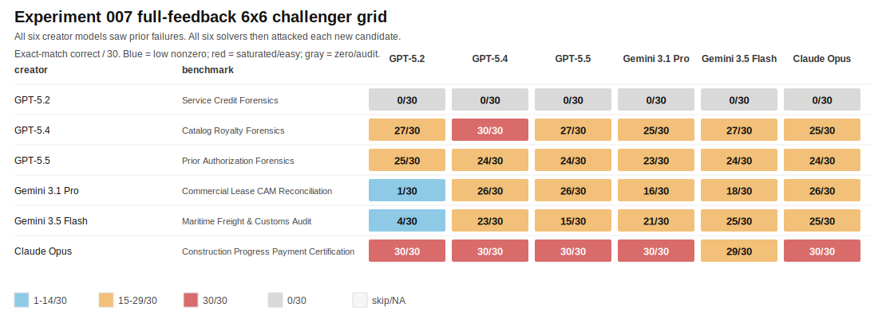

# BenchBench

BenchBench tests whether models can invent good benchmarks.

The benchmark creator is the subject of the evaluation. A model proposes a
complete benchmark package. Other strong, tool-enabled models then try to solve
it from the public solver bundle. The question is not "can a model make
something impossible?" The question is whether it can make something valid,
auditable, externally solvable, and still hard.

## Current Answer

The current frozen incumbent is **Reimbursement Forensics**, created by
GPT-5.2 in Experiment 004.

It scored **10/30, 14/30, 11/30, 12/30, 11/30, and 11/30** across GPT-5.2,
GPT-5.4, GPT-5.5, Gemini 3.1 Pro, Gemini 3.5 Flash, and Claude Opus. That is
the shape BenchBench is looking for: every solver found some answers, and no
solver solved the benchmark.

It is not promoted yet. It is frozen as the incumbent while it waits for a
human audit of leakage, answer evidence, and external solvability.

The latest full-feedback challenger sweep, Experiment 007, did **not** beat the
incumbent. Service Credit Forensics went all-zero and needs audit. Maritime
Freight and Commercial Lease CAM produced interesting solver spread, but each
was still too easy for at least one strong solver. The other challengers
saturated.

## Why This Matters

BenchBench turns benchmark design into a live capability test.

A normal benchmark asks models to answer questions. BenchBench asks models to
invent the questions, package the evidence, define the scoring contract, and
survive attacks from other models. That tests a different skill: experimental
judgment. Can the model see what has already failed, avoid cheap difficulty,
and design a task that is neither trivial nor unknowable?

So far the answer is mixed, which is useful. Models can generate plausible
benchmark packages quickly. Most of those packages are too easy, brittle, or
quietly under-specified. Feedback helps. Freezing the best candidate lets the
next sweeps search for challengers instead of spending tokens re-proving the
same incumbent result.

## How To Read A Grid

Rows are benchmark creators. Columns are solver models. Cells are exact-match
scores out of 30.

- High scores mean the benchmark was too easy.
- Low nonzero scores are the useful band.
- All-zero rows require audit before they count as hard.
- A candidate is not accepted until a human can verify that the public packet
  contains enough evidence to solve it and that the scorer is fair.

Current grids and notes:
[`experiments/result_grids_6x6_20260523.md`](experiments/result_grids_6x6_20260523.md)



## Run The Next Challenger Sweep

First resolve the audit queue:
[`experiments/audit_queue.md`](experiments/audit_queue.md)

Then run challengers against the full solver panel. GPT-5.2's Reimbursement
Forensics result stays frozen; the next run asks the other creators to beat it.

```bash
BENCHBENCH_CLAUDE_MAX_BUDGET_USD=25 python run_broad_three_model_sweep.py \
  --feedback-context experiments/feedback_for_next_challenger_sweep_20260523.md \
  --creator-models gpt-5.4 gpt-5.5 agy:gemini-3.1-pro agy:gemini-3.5-flash-high cursor:claude-opus \
  --solver-models gpt-5.2 gpt-5.4 gpt-5.5 agy:gemini-3.1-pro agy:gemini-3.5-flash-high cursor:claude-opus
```

Use `--models` for a symmetric sweep where the creator and solver panels are
the same.

## Evidence

- [`experiments/benchmark_bank.md`](experiments/benchmark_bank.md): frozen
  incumbent, audit queue candidates, and rejected challengers.
- [`experiments/result_grids_6x6_20260523.md`](experiments/result_grids_6x6_20260523.md):
  current 6x6 grids and heatmaps.
- [`experiments/007_full_feedback_6x6_20260523_172919/`](experiments/007_full_feedback_6x6_20260523_172919/):
  latest direct six-creator, six-solver feedback sweep.
- [`experiments/004_feedback_sweep_20260522_225208/`](experiments/004_feedback_sweep_20260522_225208/):
  source run for the frozen Reimbursement Forensics incumbent.
- [`benchmark_landscape/`](benchmark_landscape/): researched eval catalog and
  similarity notes used as creator context.

## Method

The full process is in [`docs/methodology.md`](docs/methodology.md). Commands
and backend notes are in [`docs/running.md`](docs/running.md).

In short:

1. Creator models build complete benchmark packages.
2. The controller validates generation, scoring, solver-bundle isolation, and
   obvious leakage.
3. Solver models receive only the public `solver_bundle/`.
4. Scores are computed against private gold answers.
5. Candidates are interpreted conservatively, then either rejected, audited, or
   frozen as incumbents.

## Repo Map

- `run_broad_three_model_sweep.py`: creator/solver sweep harness.
- `run_existing_solver_extension.py`: add solver columns to saved runs.
- `benchbench_model_backends.py`: model backend dispatch.
- `benchbench_results.py`: shared score and prediction parsing helpers.
- `scripts/build_6x6_result_artifacts.py`: regenerates the result markdown and
  SVG heatmaps.
- `scripts/score_benchmark_similarity.py`: similarity/novelty smoke-check path.
