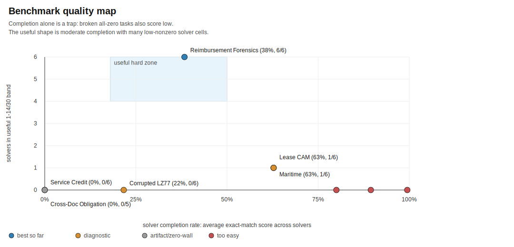

# BenchBench

BenchBench asks whether models know enough about their own limits to write good
benchmarks.

A creator model builds a complete benchmark package. Other strong, tool-using
models then solve only the public bundle. A low score is not enough. A useful
benchmark has to be solvable in principle, fair to score, and hard for reasons
we can understand.

## Current Read

The strongest benchmark so far is **Reimbursement Forensics**, created by
GPT-5.2 in Experiment 004.

It scored **10/30, 14/30, 11/30, 12/30, 11/30, and 11/30** across GPT-5.2,
GPT-5.4, GPT-5.5, Gemini 3.1 Pro, Gemini 3.5 Flash, and Claude Opus. That is
the shape we were looking for: every solver got traction, no solver solved it,
and the result was not an obvious all-zero failure.

The model story is the more interesting one: **GPT-5.2 is the best benchmark
creator so far**. It is the only creator that produced an all-solver
low-nonzero benchmark. GPT-5.4 was the strongest latest solver by Round 3 total
score. Gemini 3.1 Pro and Gemini 3.5 Flash produced the most interesting Round
3 challengers, but those tasks were still too easy for the top solvers.

We carry Reimbursement Forensics forward as the incumbent so new sweeps have
something concrete to beat.


## Strongest Benchmarks So Far

| read | benchmark | creator | score shape | what it shows |
|---|---|---|---|---|
| Strongest current candidate | Reimbursement Forensics | GPT-5.2 | 10-14/30 across all six solvers | The only all-solver low-nonzero row so far. |
| Best Round 3 challenger | Commercial Lease CAM Reconciliation | Gemini 3.1 Pro | 1-26/30 | Separated solvers sharply, but top solvers still scored too high. |
| Best Round 3 challenger | Maritime Freight & Customs Audit | Gemini 3.5 Flash | 4-25/30 | Also separated solvers, but did not hold the top end down. |
| Diagnostic, not a keeper | Corrupted LZ77 Recovery | Gemini 3.1 Pro | 0-22/30 | Hard for some solvers, but too brittle and zero-heavy. |

## Completion Proxy

Solver completion rate is a useful proxy, but only with a second number beside
it. A broken all-zero benchmark also has low completion. The better signal is:
how many solvers landed in the useful 1-14/30 band?



Reimbursement Forensics is the outlier: moderate completion, six useful solver
cells, no zero wall. Commercial Lease CAM and Maritime Freight created solver
spread, but the best solvers completed too much of them. Service Credit and
Cross-Document Obligation show why low completion alone is not enough.

## What BenchBench Is Testing

Most evals ask a model to answer. BenchBench asks it to decide what is worth
asking.

A model that understands its own limits should be able to design a task that is
hard for the right reasons. Not a trick scorer. Not an impossible packet. Not a
small rule puzzle that collapses under a script. Something with enough public
evidence for a solver to work, enough structure for a fair scorer, and enough
friction that strong agents still stumble.

The runs so far are useful because they show the failure modes. Many benchmark
ideas look serious and then saturate. Some go all-zero because the packet or
scorer is broken. The rare good shape is in the middle: solvers make partial
progress, disagree, and leave evidence of what they did and did not understand.

That is the central question now: which model can learn from those failures and
write a better test next time?

## Reading The Grids

Rows are benchmark creators. Columns are solvers. Cells are exact-match scores
out of 30.

- High scores mean the benchmark was too easy.
- Low nonzero scores are the useful band.
- All-zero rows are not automatically strong; they need a scorer or
  solvability explanation.
- Stable benchmark-bank promotion is tracked separately. The headline here is
  creator ranking.

Canonical grids and notes:
[`experiments/canonical/README.md`](experiments/canonical/README.md)

The canonical results page also includes a round-by-round creator trajectory,
the latest solver leaderboard, and Round 3 matchup summaries.

## Next Challenger Sweep

First check the known scorer/solvability problem cases:
[`experiments/review_queue.md`](experiments/review_queue.md)

Then run challengers against the full solver panel. GPT-5.2's Reimbursement
Forensics result stays frozen; the next run asks the other creators to beat it.

```bash
BENCHBENCH_CLAUDE_MAX_BUDGET_USD=25 python run_broad_three_model_sweep.py \
  --feedback-context experiments/feedback_for_next_challenger_sweep_20260523.md \
  --creator-models gpt-5.4 gpt-5.5 agy:gemini-3.1-pro agy:gemini-3.5-flash-high cursor:claude-opus \
  --solver-models gpt-5.2 gpt-5.4 gpt-5.5 agy:gemini-3.1-pro agy:gemini-3.5-flash-high cursor:claude-opus
```

Use `--models` for a symmetric sweep where creator and solver panels are the
same.

## Evidence

- [`experiments/benchmark_bank.md`](experiments/benchmark_bank.md): current
  targets, diagnostic rows, and rejected candidates.
- [`experiments/canonical/README.md`](experiments/canonical/README.md):
  current presentation-layer 6x6 grids and heatmaps.
- [`experiments/007_full_feedback_6x6_20260523_172919/`](experiments/007_full_feedback_6x6_20260523_172919/):
  raw latest direct six-creator, six-solver challenger sweep.
- [`experiments/004_feedback_sweep_20260522_225208/`](experiments/004_feedback_sweep_20260522_225208/):
  source run for the frozen incumbent.
- [`benchmark_landscape/`](benchmark_landscape/): eval catalog and similarity
  notes used as creator context.

## Method

Full process: [`docs/methodology.md`](docs/methodology.md)

Commands and backend notes: [`docs/running.md`](docs/running.md)

In short:

1. Creators build complete benchmark packages.
2. The controller validates generation, scoring, public/private isolation, and
   obvious leakage.
3. Solvers receive only the public `solver_bundle/`.
4. Scores are computed against private gold answers.
5. Candidates are rejected, diagnosed, or carried forward as targets to beat.

## Repo Map

- `run_broad_three_model_sweep.py`: creator/solver sweep harness.
- `run_existing_solver_extension.py`: add solver columns to saved runs.
- `benchbench_model_backends.py`: model backend dispatch.
- `benchbench_results.py`: shared score and prediction parsing helpers.
- `scripts/build_6x6_result_artifacts.py`: result grids and SVG heatmaps.
- `scripts/score_benchmark_similarity.py`: similarity/novelty smoke check.
