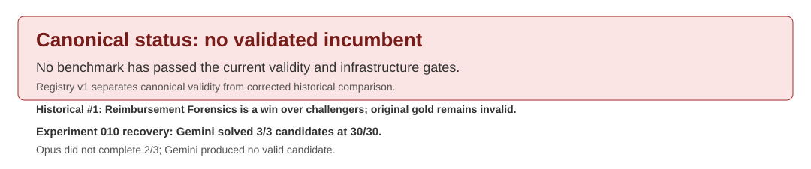

# BenchBench

BenchBench tests whether a model can create a benchmark package that strong
solvers cannot simply clear. A creator supplies public solver evidence, private
gold, a generator, verifier, scorer, and an explanation of likely failures.

## Current Result

**There is no validated incumbent.**

Reimbursement Forensics remains the **#1 corrected historical candidate** and
counts as a win over the later challengers. Recomputing its gold with Decimal
half-up arithmetic and rescoring the retained predictions gives `12/30,
16/30, 11/30, 13/30, 11/30, 11/30`: all six scores remain low and nonzero,
while later challenger rows reach at least `25/30`, are invalid, or are
incomplete. No model was rerun for this comparison.

That historical win is not a canonical promotion. The original Reimbursement
Forensics run remains invalid because its emitted gold violated Decimal
half-up rounding. Service Credit Forensics is also invalid because its public
evidence and gold use conflicting precedence rules. The Fable creator run is
incomplete: GPT-5.2 had a provider error and Claude Opus timed out. Those are
execution states, not `0/30` results.

### Modern Frontier Matrix (Score & Token Efficiency, Python Enabled)

Evaluating the four current-generation model families (**Halcyon** via Antigravity, **Claude Opus 5.5** via Cursor, **GPT-6-Sol** via Codex, and **GLM 5.2 (High)** via Cursor) with full Python tool execution across all six active benchmarks—including the repaired **Reimbursement Forensics v2 (`Experiment 015`)** under the actual policy:

| Benchmark | Creator | Halcyon (`agy`) | Claude Opus 5.5 (`cursor`) | GPT-6-Sol (`codex`) | GLM 5.2 High (`cursor`) |
|---|---|---:|---:|---:|---:|
| **Reimbursement Forensics v2 (`015`)** | GPT-5.2 (repaired) | **30/30** (`283.4k` tok) | **30/30** (`281.8k` tok) | **30/30** (`45.7k` tok) | **30/30** (`736.8k` tok) |
| **AuditWeave (`010`)** | GPT-5.6 Sol | **30/30** (`478.8k` tok\*) | **30/30** (`251.0k` tok) | **30/30** (`34.7k` tok) | **30/30** (`93.5k` tok) |
| **Counterfactual Firewall Policy Synthesis (`010`)** | GPT-5.6 Terra | **30/30** (`202.8k` tok\*) | **30/30** (`257.3k` tok) | **30/30** (`28.8k` tok) | **30/30** (`221.1k` tok) |
| **Consolidation Point (`010`)** | Claude Opus 5 | **30/30** (`116.2k` tok) | **30/30** (`73.4k` tok) | **30/30** (`35.9k` tok) | **29/30** (`208.0k` tok) |
| **CloudSLA-Forensics (`013`)** | Gemini 3.7 Flash | **30/30** (`507.5k` tok) | **30/30** (`501.0k` tok) | **30/30** (`67.7k` tok) | **30/30** (`651.4k` tok) |
| **Maritime General Average Forensics (`014`)** | Halcyon | **30/30** (`147.4k` tok) | **30/30** (`216.7k` tok) | **30/30** (`67.9k` tok) | **30/30** (`905.1k` tok) |
| **Total Score (Accuracy)** | — | **180/180 (`100.0%`)** | **180/180 (`100.0%`)** | **180/180 (`100.0%`)** | **179/180 (`99.4%`)** |
| **Total Reported Tokens (`tokens / correct`)** | — | **`1,736k` (`9.6k/item`)** | **`1,581k` (`8.8k/item`)** | **`281k` (`1.6k/item`)** | **`2,816k` (`15.7k/item`)** |

\*On `AuditWeave` and `CFPS`, Halcyon's initial `agy --print` invocation delegated to async subagents (exiting the single-turn stream early) and solved both `30/30` when run synchronously in single-turn mode. Note: When Python execution was disabled in Cursor, `GLM 5.2 (High)` dropped to `17/30` on `015`, `24/30` on `014`, `29/30` on `013`, and timed out on `AuditWeave` and `CFPS`, while `Claude Opus 5.5` still solved `015`, `014`, and `013` at `30/30` by hand.

#### Solver Leaderboard (All 6 Active Benchmarks, 180 Items)

| Rank | Model (`Provider`) | Total Score | Accuracy | Total Reported Tokens | Reported Tok / Correct | Non-Cache (`In+Out`) Tokens | No-Python Stress Test (`013`+`014`+`015`) |
| :---: | :--- | :---: | :---: | ---: | ---: | ---: | :---: |
| **1** | **GPT-6-Sol High** (`codex:gpt-6-sol@high`) | **180 / 180** | **100.0%** | **`280,756`** | **`1,560`** | `280,756` (`1,560`/item) | — |
| **2** | **Claude Opus 5.5 High** (`cursor:claude-opus-5-5-high`) | **180 / 180** | **100.0%** | **`1,581,109`** | **`8,784`** | **`35,318` (`196`/item)** | **90 / 90 (`100.0%`)** |
| **3** | **Halcyon** (`agy:halcyon`) | **180 / 180** | **100.0%** | **`1,736,199`** | **`9,646`** | `1,736,199` (`9,646`/item) | — |
| **4** | **GLM 5.2 High** (`cursor:glm-5.2-high`) | **179 / 180** | **99.4%** | **`2,815,903`** | **`15,731`** | `268,415` (`1,500`/item) | **70 / 90 (`77.8%`)** |

#### Benchmark / Creator Difficulty Leaderboard (4 Frontier Solvers)

| Rank | Benchmark | Creator Model | Frontier Panel Score (Python On) | No-Python GLM 5.2 Score | Total Tokens Forced Across 4 Frontier Solvers | Avg Tokens / Solver |
| :---: | :--- | :--- | :---: | :---: | ---: | ---: |
| **1** | **Consolidation Point (`010`)** | **Claude Opus 5.5** | **119 / 120 (`99.2%`)** | `29 / 30` | `433,516` | `108.4k` |
| **2** | **CloudSLA-Forensics (`013`)** | **Gemini 3.7 Flash** | **120 / 120 (`100.0%`)** | `29 / 30` | **`1,727,589`** | **`431.9k`** |
| **3** | **Reimbursement Forensics v2 (`015`)** | **GPT-5.2** (repaired) | **120 / 120 (`100.0%`)** | **`17 / 30`** | **`1,347,740`** | **`336.9k`** |
| **4** | **Maritime General Average Forensics (`014`)** | **Halcyon** | **120 / 120 (`100.0%`)** | **`24 / 30`** | **`1,337,120`** | **`334.3k`** |
| **5** | **AuditWeave (`010`)** | **GPT-5.6-Sol** | **120 / 120 (`100.0%`)** | Timeout | `858,021` | `214.5k` |
| **6** | **Counterfactual Firewall Policy Synthesis (`010`)** | **GPT-5.6-Terra** | **120 / 120 (`100.0%`)** | Timeout | `709,981` | `177.5k` |

Why did historical **Reimbursement Forensics (`Experiment 004`)** originally look hard (`11/30`–`16/30`)? Direct code audit of `generator.py` and `verifier.py` ([`experiments/adjudications/004_reimbursement_forensics.md`](experiments/adjudications/004_reimbursement_forensics.md)) showed that `APPROVAL_RE` double-escaped `\s` and restricted receipt IDs to uppercase `[A-Z0-9_\-]+`, matching `0/30` lowercase `reifor_xxxx_Ry` email approvals. When `APPROVAL_RE` is fixed and `amount` and `tip` are converted to USD cents per `policy.md` (`Experiment 015`), all four current-generation models (`Halcyon`, `Claude Opus 5.5`, `GPT-6-Sol`, and `GLM 5.2 High`) solve it at **`30/30` (`100%`)** when Python is enabled.

The complete, digest-backed record is in
[`experiments/registry.v1.json`](experiments/registry.v1.json). The generated
canonical view preserves historical numbers as noncanonical evidence and
promotes nothing without a fresh validated run:
[`experiments/canonical/README.md`](experiments/canonical/README.md).

## What BenchBench Measures

A valid candidate needs more than low scores. It needs public evidence that
supports every answer, a private gold path that follows the public rules,
deterministic scoring, complete successful solver cells, and an execution
environment that keeps private material inaccessible to solvers.

That is why a `0/30` can mean several different things: hard task, invalid
gold, provider error, timeout, malformed output, or an incomplete panel. Only
the first can contribute to a benchmark claim, and only after adjudication.

## Next Run

The target panel is Codex GPT-5.6 Sol high, Codex GPT-5.6 Terra extra high,
Gemini 3.6 Flash high, Gemini 3.7 Flash high, Halcyon, and Claude Opus 5.
Antigravity's live boundary is available. The current macOS runtime fails the
Codex parent-environment isolation probe, and Cursor remains preflight-only, so
a complete frontier sweep must restore the Codex boundary and use an audited
Opus provider. Exact commands and safety limits are in
[`docs/running.md`](docs/running.md).

Treat Reimbursement Forensics as the historical target to beat, not as a
validated incumbent or reusable benchmark package. Do not reuse Service Credit
Forensics as an incumbent, and do not backfill failed solver cells as scores.
Historical run folders remain immutable; solver extensions publish into new
overlay roots.

The required historical resolutions are in:

- [`experiments/adjudications/004_reimbursement_forensics.md`](experiments/adjudications/004_reimbursement_forensics.md)
- [`experiments/adjudications/007_service_credit_forensics.md`](experiments/adjudications/007_service_credit_forensics.md)
- [`experiments/adjudications/008_fable_creator_sweep.md`](experiments/adjudications/008_fable_creator_sweep.md)
- [`experiments/adjudications/010_four_model_panel.md`](experiments/adjudications/010_four_model_panel.md)
- [`experiments/adjudications/010_provider_recovery_20260802.md`](experiments/adjudications/010_provider_recovery_20260802.md)
- [`experiments/adjudications/013_gemini_37_flash.md`](experiments/adjudications/013_gemini_37_flash.md)
- [`experiments/adjudications/014_halcyon.md`](experiments/adjudications/014_halcyon.md)

## Repo Map

- `run_broad_three_model_sweep.py`: creator/solver sweep harness.
- `benchbench_model_backends.py`: provider dispatch.
- `benchbench_results.py`: prediction and score parsing.
- `experiments/registry.v1.json`: authoritative experiment and adjudication registry.
- `scripts/build_6x6_result_artifacts.py`: deterministic canonical-status generator.
- `scripts/prepare_public_evidence.py`: public-evidence sanitizer and digest rebinder.
- `scripts/build_benchmark_landscape_pack.py`: landscape pack builder.
- `docs/methodology.md`: evaluation method.
